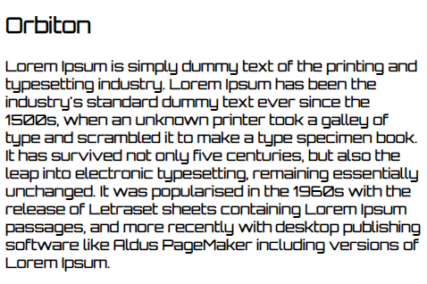
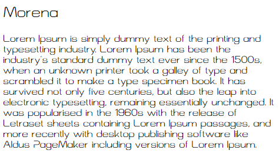
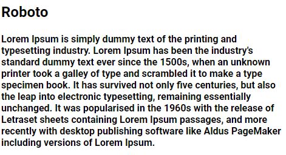
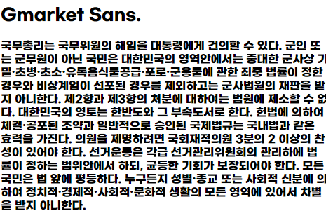
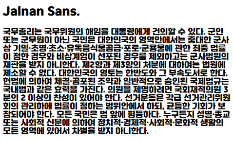
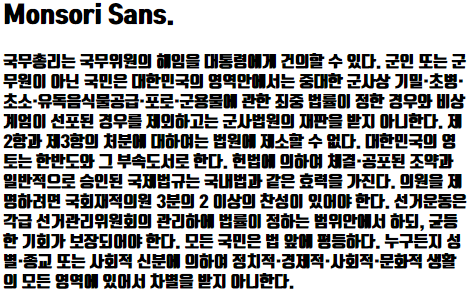
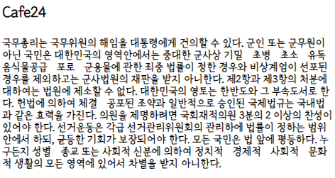
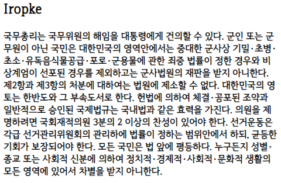
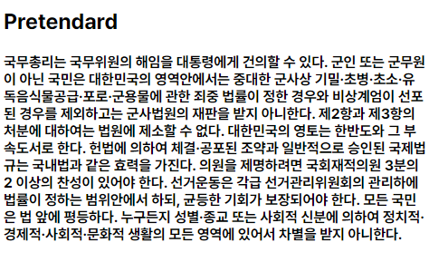

# 
 Commonly-used-fonts 

웹 디자인 시 자주 사용하는 폰트를 모아보았습니다. 사용된 폰트는 오픈소스 혹은 무료로 배포 가능한 폰트입니다.

## WebFont List

### 1. Orbiton

 

### 2. Morena

 

### 3. NationalPark

 

### 4. Roboto

 

### 5. Gmarket Sans

 

### 6. Jalnan Sans

 

### 7. Monsori Sans

 

### 8. Cafe24

 

### 9. Iropke

 

### 10 .Pretendard

